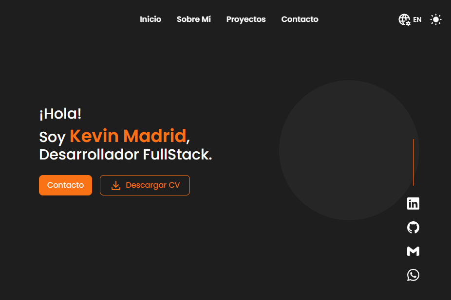

# 🌐 Portafolio Web – Kevin Madrid

¡Bienvenido a mi portafolio personal! Este proyecto fue diseñado y desarrollado con el objetivo de presentar mis habilidades como desarrollador **Fullstack**, así como compartir algunos de los proyectos en los que he trabajado.

La idea fue construir una plataforma profesional, moderna, accesible y responsiva, que refleje tanto mi estilo visual como mis habilidades técnicas.

---

## ✨ Características

- 🎨 Diseño minimalista y responsivo.
- 🌗 Soporte para modo claro y oscuro.
- 🌍 Multilenguaje dinámico, Español e Inglés.
- 📬 Formulario de contacto funcional con EmailJS.
- ⚡ Animaciones suaves y navegación fluida.
- 🔐 Accesibilidad.

---

## 🛠️ Tecnologías y herramientas

- [Angular v.19](https://v19.angular.dev/overview)
- [TailwindCSS v.4](https://tailwindcss.com/)
- [EmailJS](https://www.emailjs.com/) ⭢ para el envío de correos
- [@ngx-translate/core](https://github.com/ngx-translate/core) ⭢ para la traducción de textos
- [Figma](https://figma.com/) ⭢ diseño de interfaz
- [Vercel](https://vercel.com/) ⭢ despliegue del proyecto

---

## 📸 Preview del proyecto



---

## 🚀 Cómo instalar y ejecutar localmente

⭣ 1. Clonar el repositorio

```console
git clone https://github.com/kevinmadrid-dev/portafolio-dev.git
```

⭣ 2. Entra a la carpeta del repositorio

```console
cd portfolio
```

⭣ 3. Instalar dependencias

```console
npm install
```

⭣ 4. Ejecutar en entorno de desarrollo

```console
ng serve
```

- NOTA: El proyecto se abrirá en http://localhost:4200
